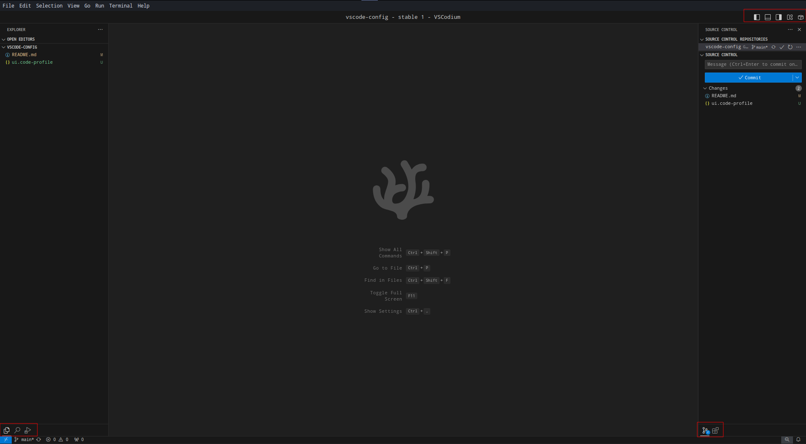

# VSCodium

1. Install [VSCodium](https://vscodium.com) (best option) or VSCode/other forks.
2. [only for forks] [Add VS Code Marketplace](https://github.com/OliverKeefe/vscode-extensions-in-vscodium?tab=readme-ov-file#how-to-use-the-vs-code-marketplace)
3. Import [profile](ui.code-profile)

## Demo

